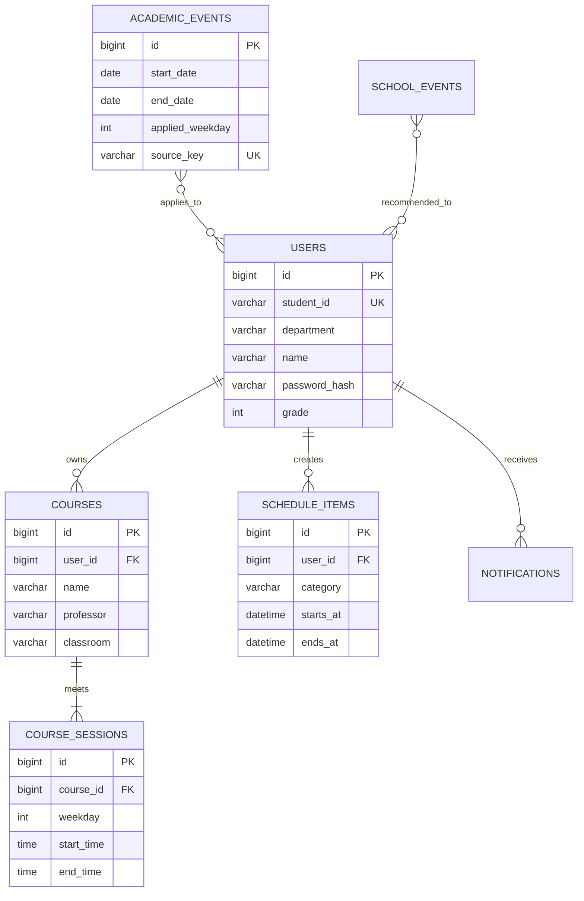

# ERD

```mermaid
erDiagram
  USERS ||--o{ COURSES : owns
  COURSES ||--|{ COURSE_SESSIONS : meets
  USERS ||--o{ SCHEDULE_ITEMS : creates
  USERS ||--o{ NOTIFICATIONS : receives
  ACADEMIC_EVENTS }o--o{ USERS : applies_to
  SCHOOL_EVENTS }o--o{ USERS : recommended_to
  USERS { bigint id PK
    varchar student_id UK
    varchar department
    varchar name
    varchar password_hash
    int grade }
  COURSES { bigint id PK
    bigint user_id FK
    varchar name
    varchar professor
    varchar classroom }
  COURSE_SESSIONS { bigint id PK
    bigint course_id FK
    int weekday
    time start_time
    time end_time }
  ACADEMIC_EVENTS { bigint id PK
    date start_date
    date end_date
    int applied_weekday
    varchar source_key UK }
  SCHEDULE_ITEMS { bigint id PK
    bigint user_id FK
    varchar category
    datetime starts_at
    datetime ends_at }
```

`weekday`와 `applied_weekday`는 월요일=0부터 일요일=6까지 사용한다. 보강일에 `applied_weekday`가 있으면 달력상의 요일 대신 해당 요일의 `COURSE_SESSIONS`를 조회한다.

